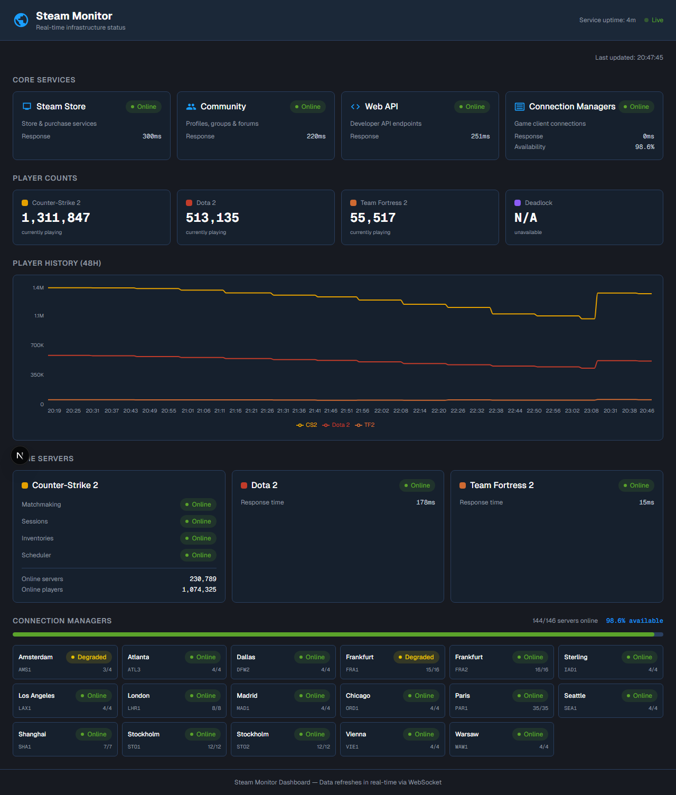

# Steam Monitor Service

Standalone Node.js service that monitors Steam infrastructure in real-time. Exposes a REST API and WebSocket for easy integration with any web application.

## What It Monitors

| Category | Details | Interval |
|----------|---------|----------|
| **Steam Store** | HTTP health check | 30s |
| **Steam Community** | HTTP health check | 30s |
| **Steam Web API** | API validation | 30s |
| **Connection Managers** | WebSocket probe of 290+ CMs across 17+ datacenters | 5 min |
| **Player Counts** | CS2, Dota 2, TF2, Deadlock | 60s |
| **CS2 Game Servers** | Matchmaking, sessions, inventories, scheduler | 60s |
| **Dota 2 / TF2** | API responsiveness | 60s |

CM servers are discovered automatically by scanning all 220 Steam cell IDs via the Steam Directory API.

## Quick Start

```bash
# Install dependencies
npm install

# Configure your Steam API key
cp .env.example .env
# Edit .env and set STEAM_API_KEY

# Run in development
npm run dev

# Build and run in production
npm run build
npm start
```

Get a free Steam API key at https://steamcommunity.com/dev/apikey

## API Endpoints

| Endpoint | Description |
|----------|-------------|
| `GET /api/v1/status` | Full status snapshot |
| `GET /api/v1/status/services` | Service statuses only |
| `GET /api/v1/status/cms` | CM server status by datacenter |
| `GET /api/v1/status/cms/servers` | Individual CM server list |
| `GET /api/v1/status/players` | Player counts |
| `GET /api/v1/status/games` | Game server status |
| `GET /api/v1/history/:metric` | Time-series data (last 48h) |
| `GET /api/v1/history` | Available history metrics |
| `GET /api/v1/health` | Service health check |
| `WS /ws` | Real-time status updates |

## Integration

CORS is enabled for all origins. Integrate from any web app:

### REST

```js
const res = await fetch('http://localhost:3300/api/v1/status');
const status = await res.json();

console.log(status.services.store.status);    // "online"
console.log(status.players.cs2);              // 1383228
console.log(status.cms.availability);         // 100
console.log(status.games.cs2.matchmaking);    // "online"
```

### WebSocket

```js
const ws = new WebSocket('ws://localhost:3300/ws');

ws.onmessage = (event) => {
  const msg = JSON.parse(event.data);

  if (msg.type === 'status') {
    // Full status update
    console.log(msg.data.services);
  }

  if (msg.type === 'statusChange') {
    // A service changed state
    console.log(`${msg.data.monitor}: ${msg.data.from} → ${msg.data.to}`);
  }
};
```

## Status Response Format

```json
{
  "time": 1773083811805,
  "uptime": 29021,
  "services": {
    "store":     { "status": "online", "responseTime": 342 },
    "community": { "status": "online", "responseTime": 265 },
    "webapi":    { "status": "online", "responseTime": 213 },
    "cms":       { "status": "online", "availability": 100 }
  },
  "cms": {
    "total": 293,
    "online": 293,
    "offline": 0,
    "availability": 100,
    "byDatacenter": {
      "fra2": { "total": 14, "online": 14, "status": "online" },
      "par1": { "total": 37, "online": 37, "status": "online" }
    }
  },
  "players": {
    "cs2": 1383228,
    "dota2": 580979,
    "tf2": 54721,
    "deadlock": null
  },
  "games": {
    "cs2": {
      "matchmaking": "online",
      "sessions": "online",
      "inventories": "online",
      "scheduler": "online",
      "onlineServers": 232847,
      "onlinePlayers": 1157791
    },
    "dota2": { "status": "online", "responseTime": 186 },
    "tf2":   { "status": "online", "responseTime": 14 }
  }
}
```

## Configuration

All settings are configurable via environment variables (see `.env.example`):

| Variable | Default | Description |
|----------|---------|-------------|
| `STEAM_API_KEY` | — | Required. Steam Web API key |
| `PORT` | `3300` | HTTP server port |
| `HOST` | `0.0.0.0` | Bind address |
| `SERVICE_CHECK_INTERVAL` | `30000` | Store/Community/WebAPI check interval (ms) |
| `CM_CHECK_INTERVAL` | `300000` | CM probe interval (ms) |
| `CM_DISCOVERY_INTERVAL` | `600000` | CM discovery refresh interval (ms) |
| `PLAYER_COUNT_INTERVAL` | `60000` | Player count fetch interval (ms) |
| `GAME_STATUS_INTERVAL` | `60000` | Game status check interval (ms) |
| `HISTORY_RETENTION_HOURS` | `48` | How long to keep time-series data |
| `LOG_LEVEL` | `info` | Log level (fatal/error/warn/info/debug/trace) |

## Architecture

```
src/
├── index.ts                     # Entry point
├── config.ts                    # Environment config
├── types.ts                     # TypeScript interfaces
├── monitors/
│   ├── BaseMonitor.ts           # Abstract base class
│   ├── StoreMonitor.ts          # Steam Store health check
│   ├── CommunityMonitor.ts      # Steam Community health check
│   ├── WebApiMonitor.ts         # Steam Web API health check
│   ├── CmMonitor.ts             # CM server WebSocket probe
│   ├── PlayerCountMonitor.ts    # Player count fetcher
│   └── GameMonitor.ts           # Game server status (CS2/Dota2/TF2)
├── services/
│   ├── MonitorManager.ts        # Orchestrates all monitors
│   ├── StatusStore.ts           # Time-series history storage
│   └── CmDiscovery.ts           # CM server discovery via Steam Directory API
└── api/
    ├── server.ts                # Fastify HTTP + WebSocket server
    └── routes.ts                # REST endpoints
```

## History Metrics

Available metrics for the `/api/v1/history/:metric` endpoint:

- `cm_availability` — CM online percentage over time
- `players_cs2` — CS2 player count
- `players_dota2` — Dota 2 player count
- `players_tf2` — TF2 player count
- `players_deadlock` — Deadlock player count

## Web Dashboard

An example Next.js dashboard is included in the `web/` directory. It connects to the monitor service via WebSocket for real-time updates and displays:

- **Core Services** — Live status cards for Steam Store, Community, Web API, and Connection Managers with response times
- **Player Counts** — Real-time player counts for CS2, Dota 2, TF2, and Deadlock
- **Player History** — 48-hour line chart of player counts across all games
- **Game Servers** — CS2 matchmaking/sessions/inventories/scheduler status, plus Dota 2 and TF2 server health
- **Connection Managers** — Datacenter-by-datacenter grid showing online/total CM servers globally

### Running the Dashboard

```bash
# 1. Start the monitor service (from project root)
npm run dev

# 2. In a separate terminal, start the web app
cd web
npm install
npm run dev
```

Open http://localhost:3000 to view the dashboard. It connects to the monitor API at `http://localhost:3300` by default.

### Preview



### Configuration

The dashboard reads two optional environment variables:

| Variable | Default | Description |
|----------|---------|-------------|
| `NEXT_PUBLIC_API_URL` | `http://localhost:3300` | Monitor service REST API base URL |
| `NEXT_PUBLIC_WS_URL` | `ws://localhost:3300/ws` | Monitor service WebSocket URL |
